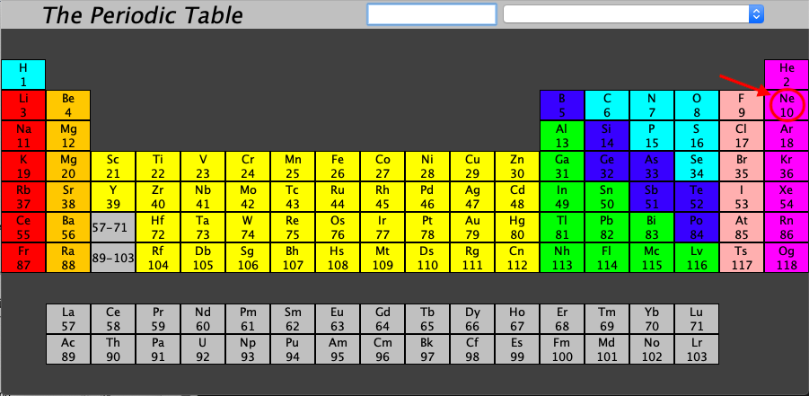
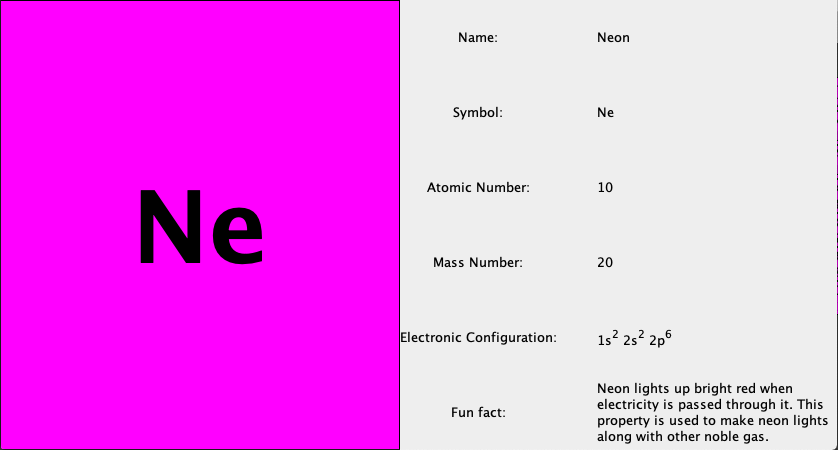
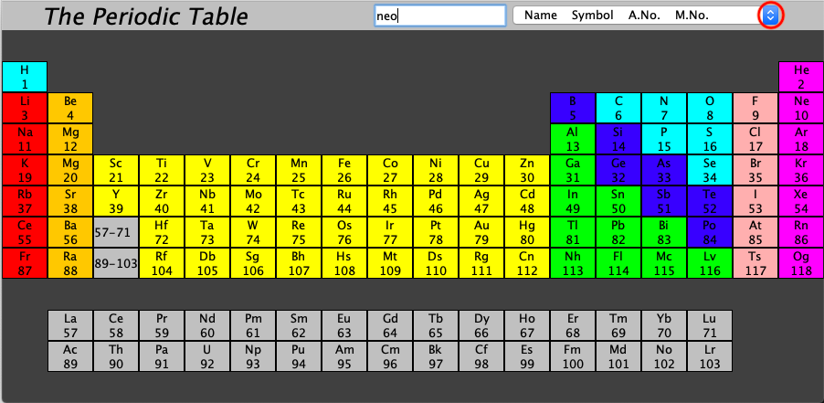
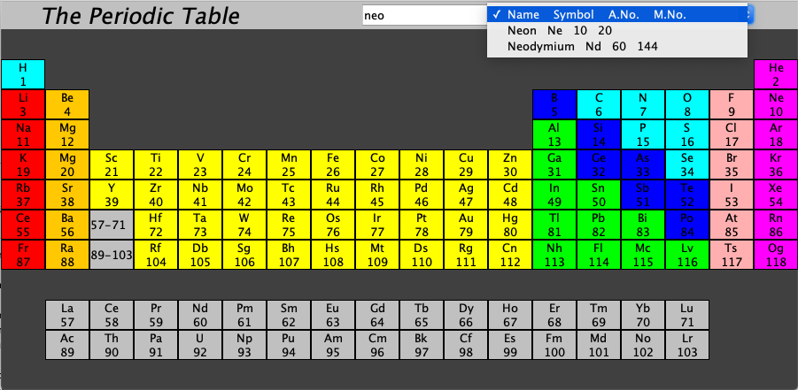

# The Periodic Table

##How To Use

####Opening the app

1. Open terminal (or command prompt if you use windows).
2. Go to the folder where you saved the jar file.
3. Type java -jar ThePeriodicTable.jar and hit enter key.

####Clicking On Elements

Clicking on elements makes a new window opens with the respective element's information.

####Searching For Elements

1) Type in the element's name or element's symbol or element's atomic number or element's mass number in the search bar.

2) Click the small button on the right end of the combo box, which is beside the search bar.

3) You can find a drop-down list of all elements matching the characters you put in the search bar. In the drop-down list, each list item contains the element name, symbol, atomic number, and mass number in that order.

4) According to your search, click on the list item.

5) A window will open containing information of your searched element.

